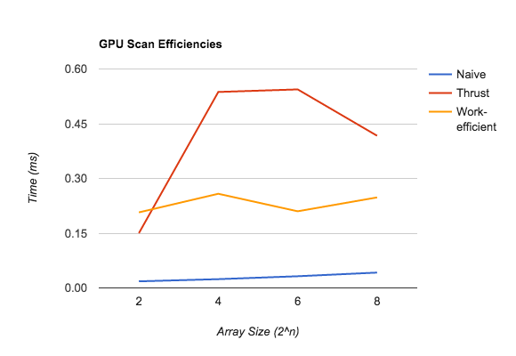

CUDA Stream Compaction
======================

**University of Pennsylvania, CIS 565: GPU Programming and Architecture, Project 2**

* Sally Kong
* Tested on: Windows 8, i7-5500U CPU @ 2.40GHz 2.40 GHz, GEForce 920M (Personal)

**Summary:** This project is an implementation of a GPU stream compaction in CUDA,
from scratch. This is a widely used algorithm that I later plan to use to accelerate my path tracer.

A few different versions of the *Scan* (*Prefix Sum*)
algorithm were implemented: a CPU version, and a few GPU implementations: "naive" and
"work-efficient." 

**Algorithm overview & details:** There are two primary references for details
on the implementation of scan and stream compaction.

* The [slides on Parallel Algorithms](https://github.com/CIS565-Fall-2015/cis565-fall-2015.github.io/raw/master/lectures/2-Parallel-Algorithms.pptx)
  for Scan, Stream Compaction, and Work-Efficient Parallel Scan.
* GPU Gems 3, Chapter 39 - [Parallel Prefix Sum (Scan) with CUDA](http://http.developer.nvidia.com/GPUGems3/gpugems3_ch39.html).

## Performance Analysis

